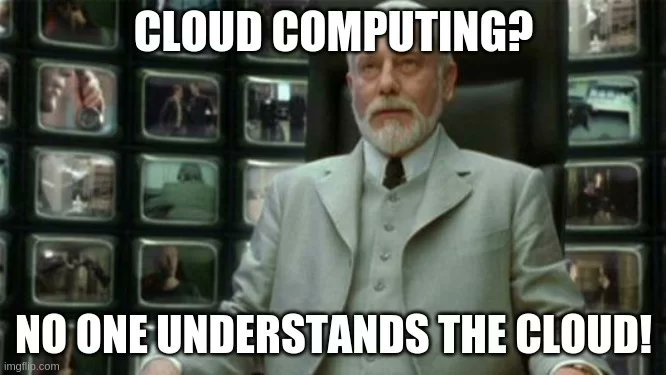

# Présentation du cours  

<!-- .slide: class="page-title" -->

## Table des matières

<!-- .slide: class="toc" -->

- **[Présentation du cours](#/1)**
- [Le contexte cloud](#/2)
- [Les services cloud](#/3)
- [Organisation des ressources](#/4)
- [Gestion d'identité et d'accès](#/5)
- [La conteneurisation](#/6)
- [L'infrastructure as code](#/7)

## Contenu du chapitre

<!-- .slide: class="toc" -->

- [Le formateur](#/le-formateur)
- [Motivation](#/motivation)
- [Certification](#/certification)
- [Vision du cours](#/vision-du-cours)

## Le formateur

<!-- .slide: id="le-formateur" -->

- Le professionnel (Missions)
  - Norauto international: Consultant architecte cloud
  - Invivoo: Ingénieur cloud
  - Société Générale CIB: Consultant DevOps
  - iph: Consultant Développeur Java
- L'apprenti (Certifications)
  - Kubernetes
  - Google Cloud Platform
  - Microsoft Azure
  - Rancher

- L'humain (Loisirs)
  - League of Legends (LoL)
  - Escalade de bloc
  - Escape games
  - Calisthenics

<figure>
    
</figure>

## Motivation

<!-- .slide: id="motivation" -->

Pourquoi le cloud:

- Secteur en `demande` constante de consultants
- Plage salariale dans la fourchette `haute` du marché
- Mise en place et manipulation de `nouvelles` technologies
- `Agnostique` au langage utilisé
- `Peu` de seniors voir pas du tout
- `Valorisation` des certifications

<figure>
    
</figure>

## Certification

<!-- .slide: id="certification" -->

- Ressources Internet d’auto apprentissage
  - Linux academy
  - [Cloud Guru](https://acloudguru.com/)
- Plusieurs certifications disponibles
  - Cloud provider: [Azure](https://docs.microsoft.com/fr-fr/learn/certifications/), [GCP](https://cloud.google.com/certification?hl=fr), [AWS](https://aws.amazon.com/fr/certification/)…
  - Métier: Admin, Développeur, Data engineer, Security engineer…

## Vision du cours

Pourquoi ce cours:

- Introduire des `principes` de bases `inter-cloud`
- Présenter des `technologies courantes` du cloud
- Préparer aux `premiers entretiens` Cloud et DevOps
- Entamer le chemin de `certification`
