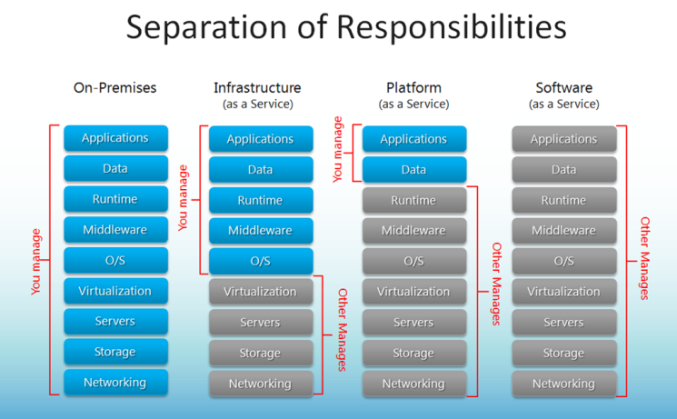

# Les services cloud

<!-- .slide: class="page-title" -->

## Table des matières

<!-- .slide: class="toc" -->

- [Présentation du cours"](#/1)
- [Terminologie](#/2)
- [Le contexte cloud](#/3)
- **[Les services cloud](#/4)**
- [Organisation des ressources](#/5)
- [Gestion d'identité et d'accès](#/6)
- [La conteneurisation](#/7)
- [L'infrastructure as code](#/6)

## Contenu du chapitre

<!-- .slide: class="toc" -->

- [Types de services](#/types)
- [Catégories de services](#/category)
- [Localisation de services](#/localization)

## Types de services

<!-- .slide: id="types" -->

Le type de service est basé sur la notion de responsabilité. Pour identifier le type de service, il faut se poser la question `Qui gère quoi ?`

<figure>
    
</figure>

## Types de services - exemple

Exemple d'une application `Java`:

| Type       | Tâches                                                                                                                                                                            | Exemple                                       |
| ---------- | --------------------------------------------------------------------------------------------------------------------------------------------------------------------------------- | --------------------------------------------- |
| On premise | Création du réseau Création du stockage Mise en place de la machine Installation de l'OS Installation Java Déploiement de l'application Accéder à l'application | Machine dans un datacenter                    |
| IaaS       | Choix de l'OS Installation Java Déploiement de l'application Accéder à l'application                                                                                     | GCP: Compute Engine Azure: Virtual Machine |
| PaaS       | Déploiement de l'application Accéder à l'application                                                                                                                           | GCP: App engine/GKE Azure: App service/AKS |
| SaaS       | Accéder à l'application                                                                                                                                                           |                                               |

## Catégories de services

<!-- .slide: id="category" -->

Les services proposé par le cloud sont de différentes catégories:

| Catégorie                   | Exemple GCP                                                                                   | Exemple Azure                                                                        |
| --------------------------- | --------------------------------------------------------------------------------------------- | ------------------------------------------------------------------------------------ |
| Calcul (Compute)            | Compute engine App engine Cloud run Cloud function Google Kubernetes Engine (GKE) | Virtual machines App service Azure functions Azure Kubernetes Service (AKS) |
| Réseau (Network)            | Virtual Private Clouds (VPCs) Load balancers Cloud router Cloud CDN                  | Virtual Networks Load balancer Application gateway Azure CDN                |
| Stockage (Storage)          | Cloud Storage Filestore                                                                    | Storage Accounts Azure data share                                                 |
| Base de donnée (Data bases) | Cloud SQL Cloud Spanner Big table Big Query Firestore Memorystore              | Cosmos DB Azure SQL Maria db                                                   |

## Localisation des services

<!-- .slide: id="localization" -->

Les services cloud proposent plusieurs niveau de localisation:

| Catégorie | Définition                                                                    | Exemple GCP                                                  | Exemple Azure                                                     |
| --------- | ----------------------------------------------------------------------------- | ------------------------------------------------------------ | ----------------------------------------------------------------- |
| Régional  | Service restreint à une seule région                                          | Compute engine GKE Cloud SQL Cloud storage (region) | Virtual machine AKS Azure SQL Storage account (mode ZRS) |
| Global    | Service accéssible depuis plusieurs localisations géographiques (voir toutes) | Cloud Spanner Cloud storage (multi-region)                | Cosmos DB Storage account (mode GRS)                           |

Carte des régions GCP disponible [ici](https://cloud.google.com/about/locations?hl=en#regions)

Carte des régions Azure disponible [ici](https://azure.microsoft.com/en-gb/global-infrastructure/geographies/)

## Les services cloud - Conclusion

Le choix d'un service cloud par rapport à un autre se fait en se basant sur les critères suivants:

- Catégorie: Que concerne mon service ? C'est du réseau, de la base de donnée, etc.
- Type: Que suis-je prêt à manager dans le service ? Je veux une solution clé en main, j'ai suffisament de maitrise pour gérer certaines couches, etc.
- Localisation: De quelle localisation ai-je besoin d'accéder à mon service ? Tout mes clients sont en France, J'ai des clients sur plusieurs continents, etc.

Il existe, également, d'autres critères de selection tel que le temps de réponse d'un service, son coût, etc.

Des arbres de décisions existent pour aider à aiguiller le choix.

Pour GCP par exemple, vous pouvez vous referrez à cet [article](https://medium.com/google-cloud/a-gcp-flowchart-a-day-2d57cc109401)

<!-- .slide: class="page-questions" -->