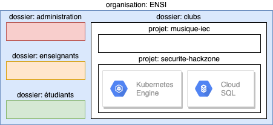
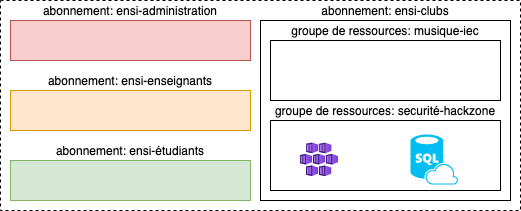

# Organisation des ressources

<!-- .slide: class="page-title" -->

## Table des matières

<!-- .slide: class="toc" -->

- [Présentation du cours"](#/1)
- [Terminologie](#/2)
- [Le contexte cloud](#/3)
- [Les services cloud](#/4)
- **[Organisation des ressources](#/5)**
- [Gestion d'identité et d'accès](#/6)
- [La conteneurisation](#/7)
- [L'infrastructure as code](#/6)

## Contenu du chapitre

<!-- .slide: class="toc" -->

- [Les ressources sur GCP](#/gcp-resources)
- [Les ressources sur Azure](#/azure-resources)
- [Création d'un projet GCP](#/create-gcp-project)

## Les ressources sur GCP

<!-- .slide: id="gcp-resources" -->

GCP propose l'arborescence suivante:

- L'organisation (organization): représente l'`entité globale` qui utilise les ressources.
- Le dossier (folder): représente souvent un `département` ou une `entité business`.
- Le projet (project): représente un `use case` business.
- La ressource (resource): représente le `service` cloud utilisé.

<figure>
    
</figure>

## Les ressources sur Azure

<!-- .slide: id="azure-resources" -->

Azure propose l'arborescence suivante:

- L'abonnement (subscription): représente souvent un `département` ou une `entité business`.
- Le groupe de ressource (resource group): représente un `use case` business.
- La ressource (resource): représente le `service` cloud utilisé.

<figure>
    
</figure>

## Conclusions

L'arborescence cloud imposée est souvent faite à des fin de facturation ou de séparation de droits.

Dans le cas GCP, les niveaux `organisation` et `dossier` sont souvent limité à un domaine (@ensi-uma.tn, @zenika.com, etc). Pour les comptes non business ou particulier, GCP nous limite à l'utilisation des projets.

<!-- .slide: class="page-tp1" -->

<!-- .slide: class="page-questions" -->