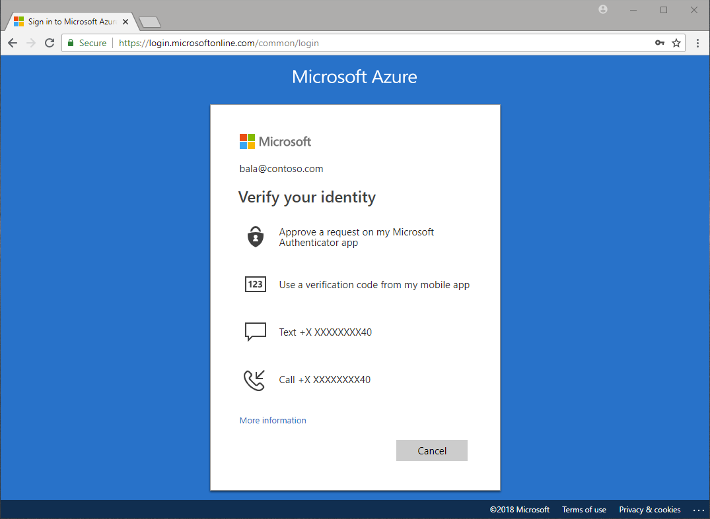

# Gestion d'identité et d'accès

<!-- .slide: class="page-title" -->

## Table des matières

<!-- .slide: class="toc" -->

- [Présentation du cours"](#/1)
- [Terminologie](#/2)
- [Le contexte cloud](#/3)
- [Les services cloud](#/4)
- [Organisation des ressources](#/5)
- **[Gestion d'identité et d'accès](#/6)**
- [La conteneurisation](#/7)
- [L'infrastructure as code](#/6)

## Contenu du chapitre

<!-- .slide: class="toc" -->

- [Gestion d'identité](#/identity)
- [Gestion d'accès](#/access)
- [Conclusion](#/iam-conclusion)

## Gestion d'identité

<!-- .slide: id="identity" -->

La gestion d'`identité` (identity), concerne les profils des utilisateurs des services.

Plusieurs moyens existent afin de prouver l'identité d'une personne, on notera principalement les suivants:

- Active directory
- Oauth2
- 2FA

### L'active directory

C'est une technologie très répondue qui se base sur la notion d'annuaire. L'ensemble des collaborateurs et des services (machines, applications, etc) sont définit de façon centralisée.

Ça peut être un active directory classique on premise ou un Azure Active Directory par exemple.

Il est à noter que les cloud providers proposent des moyens de synchronisation entre l'active directory on prem et l'annuaire managé.

### Oauth2

On délègue la tâche d'authentification à un autre organisme tel que `google` ou `facebook` par exemple. Le cloud n'est pas le seul à adopter cette approche, de nombreux sites et applications (les jeux par exemple) se basent souvent sur ce mécanisme.

Par exemple, sur le jeu LoL, on peut se connecter avec `google`, `facebook` et `apple`.

<figure>
    
</figure>

### 2FA (2 factor Authentication)

C'est un mécanisme qui se base sur deux étape:

1. Fournir un mot de passe
2. Valider l'identité via un code transmis par un élément personnel tel qu'un SMS sur votre smarthphone, ou encore une application tel que google authenticator ou microsoft authenticator.

Voir documentation [azure](https://docs.microsoft.com/fr-fr/azure/active-directory/authentication/concept-mfa-howitworks) pour plus de détails.

<figure>
    
</figure>

## Gestion d'accès

<!-- .slide: id="access" -->

La gestion d'`accès` (access), corcerne les permissions sur une ressource donnée.

Les cloud providers implémentent la gestion d'accès comme suit:

- Définition de `roles`: un role est un `ensemble de permissions` sur une ou plusieurs ressources. On peut également parler de matrice de droits.
- `Héritage`: un role est `propagé` du parent à l'enfant. Par exemple un role donné au niveau d'une organisation ou d'un folder, est actif au niveau des projets et ressources incluses dedans.
- Approche  `permissive`: un droit donné à un niveau élevé ne peut `pas être révoqué` à un niveau plus bas. Par exemple, un  rôle d'`écriture` au niveau d'une organisation ou d'un folder sera toujours `prioritaire` par rapport à un rôle de `lecture` au niveau d'une ressource inclus dedans.

## Conclusion

<!-- .slide: id="iam-conclusion" -->

La gestion de l'identité et de l'accès (Identity & Access Management) se résume à répondre à la question suivante:

`Qui` accède à `quelles` ressource et `quelles` opérations peut-il faire dessus ?

Une bonne pratique au niveau de l'IAM est le `principe du moindre privilège` (least privilege principle) qui consiste à donner le `minimum` de droit à un utilisateur pour qu'il puisse effectuer sa mission.

Par exemple, fournir un lien de `lecture` avec une `durée limitée` à des partenaires souhaitant accéder `temporairement` à un fichier sur google cloud storage.
