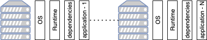
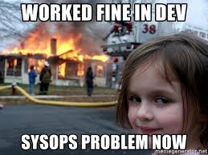
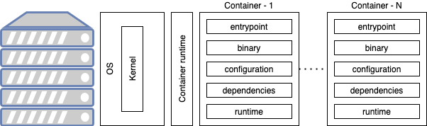
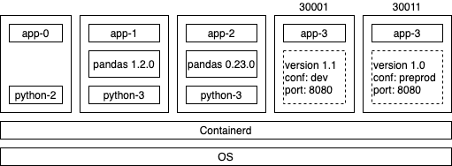

# La conteneurisation

<!-- .slide: class="page-title" -->


## Table des matières

<!-- .slide: class="toc" -->

- [Présentation du cours"](#/1)
- [Terminologie](#/2)
- [Le contexte cloud](#/3)
- [Les services cloud](#/4)
- [Organisation des ressources](#/5)
- [Gestion d'identité et d'accès](#/6)
- **[La conteneurisation](#/7)**
- [L'infrastructure as code](#/6)


## Contenu du chapitre

<!-- .slide: class="toc" -->

- [Modèle de déploiement classique](#/old-deployment)
- [Limites du modèle classique](#/old-deployment-limits)
- [La conteneurisation](#/containers)
- [Docker](#/docker)
- [Bonnes pratiques de la conteneurisation](#/containers-best-practices)


## Modèle de déploiement classique

<!-- .slide: id="old-deployment" -->

Les composants d'un déploiement sont comme suit:

| Elément                                                  | Commentaires                                                                                                                      |
| -------------------------------------------------------- | --------------------------------------------------------------------------------------------------------------------------------- |
| Le système d'exploitation                                | Dans le cas de .NET classique, on doit être sur du windows par exemple.                                                           |
| L'environnement d'exécution<br>(runtime)                 | Dans le cas d'une application java, ça va être la JRE dans la version adéquate.                                                   |
| Les dépendances<br>(dependencies)                        | Les packages système et les librairies nécessaires à l'exécution de l'application.                                                |
| Les scripts de lancement<br>(startup scripts/entrypoint) | Des script utilitaire permettant de lancer/arrêter ou relancer une application.                                                   |
| La configuration<br>(configuration)                      | Les fichiers permettant de modifier le comportement de l'application, par exemple selon l'environnement, dev, preprod, prod, etc. |
| L'exécutable<br>(binary)                                 | Dans le cas d'une application java, ça va être un jar. Pour une application python, c'est le code source lui même.                |


## Déploiement - Une machine par OS

Une approche de déploiement serait de déployer plusieurs applications sur une seule grosse machine.

<figure>
    
</figure>

- Que faire si deux applications ont besoin de versions différentes de la runtime ?
- Que faire si deux applications ont besoin de versions différentes d'un package (dépendance) ?
- Que faire si une application bug et cause une pénurie de ressources ? (noisy neighbour)
- Que faire si une application comprend une vulnérabilité ?
- Que faire si une mise à jour de l'OS cause une regréssion sur une seule application ?
- Comment assurer un même comportement entre les différents environnements (dev, preprod,...) ?


## Déploiement - Une machine par application

Une approche de déploiement serait de déployer une application par machine.

<figure>
    
</figure>

- Qui gère les mise à jour d'OS ?
- Qui gère la correction de vulnérabilité de dépendances ?
- Qui a les droits d'accès aux serveurs ?
- Que faire si l'application a des cycles idles et d'autres où il y a un pic de consommation de ressources ?

<figure>
    
</figure>


## Limites du modèle classique

<!-- .slide: id="old-deployment-limits" -->

Les limites des modèles de déploiement classiques sont principalement:

- Dans le modèle 1 à N:
  - Manque d'`isloation`
  - Manque de `determinisme` (reproductibilité entre environnement): dans le cas où les applications "voisines" ne sont pas les même en dev, preprod, etc.
- Dans le modèle 1 à 1:
  - `Mauvaise utilisation` des ressources
  - Manque de `determinisme` (reproductibilité entre environnement): dans le cas d'une gestion manuelle des serveurs.


## La conteneurisation

<!-- .slide: id="containers" -->

Un conteneur (container) correspond à une `encapsulation` d'une application, capable d'utiliser les fonctionnalité du `kernel` d'une machine afin de s'exécuter dans un environnement `isolé` grâce à un environnement d'exécution de conteneur (`container runtime`).

Les environnements d'exécutions de conteneurs les plus connus sont:

- docker
- containerd

Un conteneur encapsule les éléments suivants:

<figure>
    
</figure>


## Caractéristiques d'un conteneur

Les caractéristiques principale des conteneurs sont les suivants:

- Isolation (isolated): Ce qui se fait dans le coneteneur se limite au conteneur (variable d'environnement, système de fichier, ports, etc).
- Non persistent (Stateless): Ce qui se fait dans le conteneur meurt avec le conteneur (sauf si on utilise les volumes).
- Volatile (volatile): Un conteneur est susceptible de redémarrer à tout instant et sa durée de vie est limitée (en comparaison avec une VM par exemple).
- Léger (lightweight): Un conteneur partage le kernel du système d'exploitation de la machine hôte, il n'a donc pas besoin d'un OS par application.


## Volumes et ports

#### Exposition de port

Par défaut, les `ports` du conteneur ne sont `pas exposés` sur la machine hôte. Une application tournant sur le port 8080 peut être accessible dans le conteneur mais pas depuis la machine elle même.

Cette isolation peut être rompue en demandant explicitement l'exposition du port. Dans le cas de `docker`, c'est fait via un paramètre `-p machineport:containerport`

#### Exposition du système de fichiers

Par défaut, les `systèmes de fichiers` de la machine hôte et du conteneur sont `isolés`. Si, une application crée un fichier `my-file.txt` dans un conteneur, le fichier ne sera pas visible sur la machine hôte.

Cette isolation peut être rompue en demandant explicitement le partage du dossier. Dans le cas de `docker`, c'est fait via un paramètre `-v machinepath:containerpath`


## Avantage pour le déploiement

L'isolation au niveau du conteneur permet de déployer, sur une même et seule machine hôte:

- des environnements différents d'une même application.
- des versions différentes d'une même application.
- des applications qui utilisent une même dépendance mais exigents des versions différentes.
- des applications qui exposent un même port.


<figure>
    
</figure>


## Docker

Docker est un environnement d'exécution de conteneur, tout comme containerd.

Il permet de créer et d'exécuter les conteneur.

Quand on parle de docker, 3 notions reviennent souvent:

- Le dockerfile
- L'image
- Le conteneur


#### Dockerfile

Un `dockerfile` est un fichier recette qui comprend des instructions.

`Chaque instruction` entraîne la création d'`une couche` (layer).

```
FROM python:3.7-slim
COPY main.py /app/bin
CMD ["python", "/app/bin/main.py"]
```

Les couches (layers) définies dans ce `dockerfile` sont:

| Instruction                          | commentaire                                                                                   |
| ------------------------------------ | --------------------------------------------------------------------------------------------- |
| `FROM` python:3.7-slim               | partir initialement de python 3.7                                                             |
| `COPY` main.py /app/bin              | copier le script `main.py` depuis la machine hôte dans le conteneur sous le chemin `/app/bin` |
| `CMD` ["python", "/app/bin/main.py"] | définir la commande à lancer au démarrage du conteneur                                        |


#### Image

Une `image`  est un livrable qui contient un ensemble de couches définit dans le `dockerfile`.

Pour construire une image on utilise la commande qui suit:

```
docker build -f mydockerfile -t myimagename:0.0.1 .
```

La construction se fait en incrémental:

1. Lire une instruction du docker file et l'exécuter
2. Construire une image intermédiaire
3. Partir de la nouvelle image intermédiaire
4. Reprendre l'étape 1


#### Conteneur

La commande `run` permet de lancer un `conteneur` à partir d'une image

```
docker run myimagename:0.0.1
```

#### Variables d'environnement

On peut surcharger les valeurs des variables d'environnement pour un conteneur comme suit:

```
docker run -e CONF="preprod" myimagename:0.0.1
```

#### Commande au démarrage

On peut surcharger la commande à lancer au démarrage:

```
docker run myimagename:0.0.1 /bin/bash
```


## Bonnes pratiques de la conteneurisation

<!-- .slide: id="containers-best-practices" -->

L'utilisation des conteneurs peut être optimisée en suivant les guidelines ci-dessous:

- Favoriser le `stateless`: tenant compte de leur aspect volatile, les conteneurs ne sont pas spécialement adapté pour les applications à état. Il est mieux de connecter votre conteneur à une base de donnée externe (service cloud par exemple), plutôt que d'utiliser les volumes pour la persistence.
- Viser un `démarrage rapide`: tenant compte de leur aspect volatile, les conteneurs sont susceptible au redémarrage. Il est donc important, que les applications conteneurisées puissent démarrer rapidement.
- Opter pour une `image de base réduite`: L'image de base est notre toute première couche, elle affecte directement la taille de notre image finale et sa surface d'attaque.
- Réflechir à l'`ordre des instructions`: l'ordre des instructions de création peut favoriser ou pas l'utilisation de cache et donc améliorer le temps de construction des iimages et leurs coût de stockage. (à voir dans le TP)


<!-- .slide: class="page-questions" -->