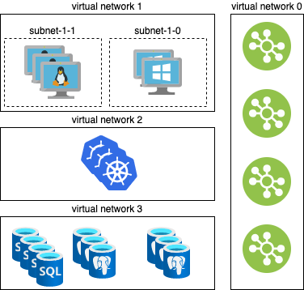
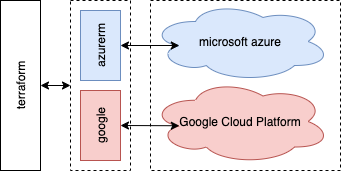

# Infrastructure as Code

<!-- .slide: class="page-title" -->


## Table des matières

<!-- .slide: class="toc" -->

- [Présentation du cours"](#/1)
- [Terminologie](#/2)
- [Le contexte cloud](#/3)
- [Les services cloud](#/4)
- [Organisation des ressources](#/5)
- [Gestion d'identité et d'accès](#/6)
- [La conteneurisation](#/7)
- **[L'infrastructure as code](#/6)**


## Contenu du chapitre

<!-- .slide: class="toc" -->

- [Gestion classique de l'infrastructure](#/infrastructure-complexity)
- [Infrastructure as Code](#/iac)
- [Terraform](#/terraform)


## Gestion classique de l'infrastructure

Le système d'information d'une entreprise, comprend plusieurs composants d'infrastructure (réseaux, sous réseaux, load balancer, base de données, machine virtuelles, clusters, etc).

Gérer efficacement son infrastructure devient rapidement complexe et propose de nombreux défis:

- Comment savoir ce qui est déployé à un instant t ?
- Comment recréer la même architecture en cas d'incident majeur ?
- Comment rajouter ou enlever des ressources ?

<figure>
    
</figure>


#### Scripting

Une solution possible serait de créer des scripts pour les tâches recurrentes tel que la création de ressources, la supression ou le redimensionnement.

#### Recruter plus d'ingénieur infrastructure

Une deuxième solution serait de recruter plus d'ingénieur infrastructure (sysops) et de leurs définir des scopes d'intervention limités.

#### Cependant

- Comment faire le suivit des opérations ?  qui a lancé quoi ? dans quel ordre ?
- Comment gérer les relances ?
- Comment gérer la suppression ?
- Quel est l'état actuel ?
- Comment reconstituer l'état global ?


## Infrastrcutre as Code

Tout comme on gère le code dans un outil de versionning, l'idée est de créer des versions d'infrastructure.

On limite dans ce cas les opérations manuelles et les interventions humaines uniquement à des commits.

Ceci propose les avantages ci-dessous:

- `Traçabilité`: consulter l'historique des commits permet de voir qui a demandé la modification, l'heure et la cause.
- `Suivi`: on peut passer par des demandes de merge (merge request) afin d'avoir la confirmation et le retour des autres.
- `Visibilité`: en observant l'état du code on peut savoir ce qui est actuellement déployé.
- `Reconstitution`: en récupérant une version précise du code on peut retourner à un état précédent.


## Terraform

Terraform est la solution de référence pour l'IaC.

Terraform a une approche déclarative qui se base sur le `desired state configruation`  et qui consite à décrire l'état voulu plutôt que de définir comment y arriver.

Par exemple, au lieu d'écrire du script bash ou python pour instancier une VM, on va simplement indiquer à terraform les informations de cette VM (nom, espace disque, RAM, CPU, etc).

L'avantage de cette apparoche est qu'elle est `idempotente` par nature. Si on refait la demande à terraform pour la même VM, il nous indiquera simplement qu'il n'y a rien à faire, puisque la VM existe déjà.


#### Les commandes terraform

Terraform propose 3 commandes principales:

- `plan`: crée un plan terraform qui nous indique les modifications que terraform compte appliquer. Création, suppression ou remplacement de ressources.
- `apply`: lance les opérations indiquées par le plan et crée un fichier `state` qui correspond au nouvel état de l'infrastructure.
- `destroy`: supprimes toutes les ressources mentionnées dans le fichier `state`.

#### Fonctionnement

Une exécution terraform correspond aux étapes suivantes:

1. Consulter le fichier d'état et le comparer à l'état réel de l'infrasturcture pour s'assurer qu'il est à jour.
2. Consulter l'état désiré et le comparer à l'état réel mis à jour.
3. Construire un `plan d'exécution`.
4. Appliquer les modifications pour atteindre l'état désiré et mettre à jour le fichier d'état.


## Le language HCL

Terraform étant un produit de l'entreprise HashiCorp, il utilise le HCL (HashiCorp Configuration Language). Ce language déclaratif ressemble à ce qui suit:

```
resource "google_sql_database_instance" "example_database" {
  name             = "example-database"
  database_version = "POSTGRES_11"
  region           = "us-central1"

  settings {
    tier = "db-f1-micro"
  }
}
```

Ce code permet la création d'une instance google cloud sql postgres nommée "example-database" dans la région "us-central1" avec une machine de type "db-f1-micro".


Un code quasi équivalent sur azure ressemblerait à ce qui suit:

```
resource "azurerm_postgresql_server" "example_database" {
  name                = "example-database"
  location            = "central-us"
  resource_group_name = "example-resource-group"

  sku_name   = "GP_Gen5_4"
  version    = "11"
}
```

Comme indiqué dans la présentation de terraform, on ne fait que déclarer l'`état désiré`:

"Je veux une instance de base de donnée postgres dans le centre des états unis en version 11 qui s'appelle example-database"

On ne donne donc aucune information, ni indication sur l'implémentation.


## Les providers

L'implémentation de la création de ressources par terraform se base sur la notion de providers.

Un provider, comme par exemple `google` ou `azurerm` qu'on vient de voir permettent à terraform d'appeler les apis des clouds providers tel que google et azure pour réaliser les opérations nécessaires à la création de ressources.

Chaque provider est résponsable de documenter l'ensemble des ressources qu'il manipule. Le [registry](https://registry.terraform.io/) de provider propose une documentation d'utilisation officielle.

La configuration d'un provider correspond souvent à renseigner des identifiants afin de permettre à terraform de s'authentifier et d'intéragir avec les apis.

<figure>
    
</figure>


<!-- .slide: class="page-questions" -->